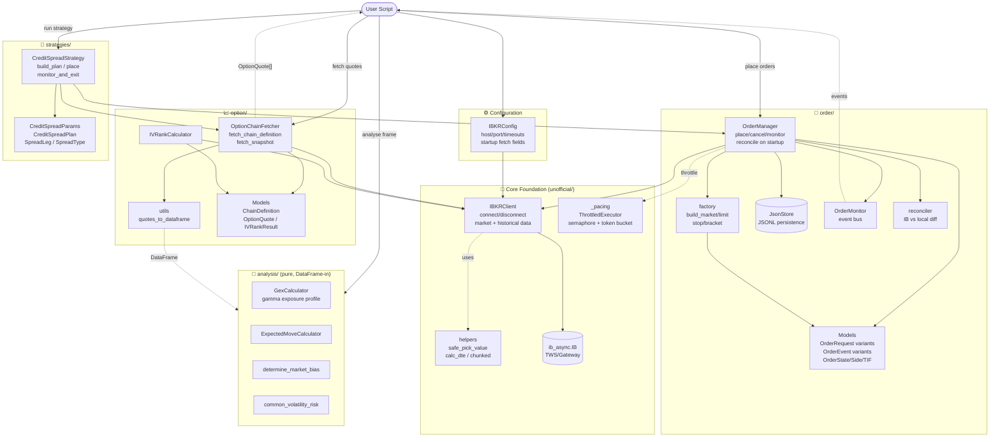

# ibtws Architecture

Package functionality overview. Open this file in VS Code with the Markdown preview (`Cmd+Shift+V`) and the `bierner.markdown-mermaid` extension, or view on GitHub.

## Layering

**Dependency direction (clean):** `strategies → order/option → client → ib_async`.
Lower layers never import upward.

The `analysis` package is intentionally decoupled: it depends only on
pandas / numpy / scipy and consumes the DataFrame produced by
`option.utils.quotes_to_dataframe` (plus VIX / price series). This keeps the
analytics pure and trivially unit-testable, independent of any IB connection.

## Typical flow

`IBKRConfig` → `IBKRClient.connect()` → spawn `OptionChainFetcher` +
`OrderManager` → compose into `CreditSpreadStrategy` for end-to-end
discover → select → place → monitor → exit. Chain snapshots can be flattened
to a DataFrame and fed into the `analysis` calculators (GEX, expected move,
market bias, volatility risk) independently of the order path.
