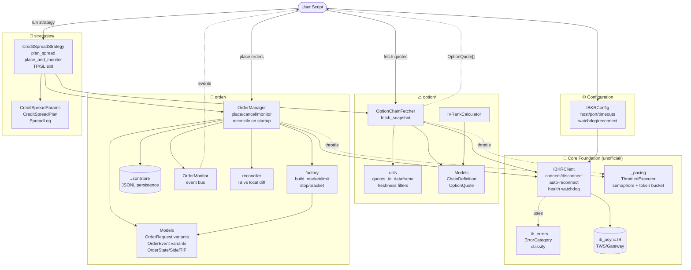

# ibtws Architecture

Package functionality overview. Open this file in VS Code with the Markdown preview (`Cmd+Shift+V`) and the `bierner.markdown-mermaid` extension, or view on GitHub.

## Typical Flow

`IBKRConfig` → `IBKRClient.connect()` → spawn `OptionChainFetcher` + `OrderManager` → compose into `CreditSpreadStrategy` for end-to-end discover → select → place → monitor → exit.
